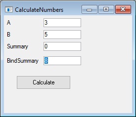

### Markdown file
1.	The **BindValue **method (called Init in Magic) of the Column object allows us to dynamically set the value of the column, by an expression.
2.	Add the local `NumberColumn` and name it `BindSummary`.
```diff
public class CalculateNumbers : UIControllerBase
    {
        public NumberColumn A = new NumberColumn();
        public NumberColumn B = new NumberColumn();
        public NumberColumn Summary = new NumberColumn();
+       public NumberColumn BindSummary = new NumberColumn();
```
3.	Inside the Constructor of the class (CalculateNumbers method)bind the summary value with A+B
```diff
public class CalculateNumbers : UIControllerBase
    {
        public NumberColumn A = new NumberColumn();
        public NumberColumn B = new NumberColumn();
        public NumberColumn Summary = new NumberColumn();
        public NumberColumn BindSummary = new NumberColumn();
        
        public CalculateNumbers()
        {
+            BindSummary.BindValue (() => A + B ); 
        }
```

4.	Notice that `()=>` is the C# syntax for **“lambda expression”**, which is a way to send an expression as a parameter. The expression will be evaluated by the receiver at a later time. We’ll see several usages of this syntax during the training, which will make it clearer. For now, all you need to understand is the syntax.
Build and add it to the form using the Column Wizard (Use the arrows to move it down on the screen)
5.	Place the BindSummary column on the form: 

6.	Run the program and **change the value of A and B** and see that BindSummary value is changing accordingly. 
7.	Exercise: BindValue
