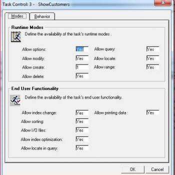
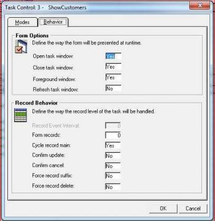

# Comparison with Magic's Task Control Dialog Box

## Introduction
This article is one of a series of articles aimed at providing further orientation with the migrated code for Magic programmers. This time we will look at the 'Task Control' (Control-C) screens as they appear in eDeveloper (version 9) and show the equivalent representation of its properties in the migrated code. Many of the properties have various options and we will also look at the different representations in the migrated code for each option.

There are two tabs for the Task Control dialog boxes in eDeveloper, with the following tags: Modes and Behavior. Let's look at each Tab separately.

## Modes Tab
A screen shot of eDeveloper's Modes tab appears below:



The following notes explain the equivalent to these properties in the migrated code.

### Allow Options

Name in Migrated Code: **AllowActivitySwitch**
Location in Migrated Code: **OnLoad Method**
Example:

``` AllowActivitySwitch = true;```

Example with expression:

``` BindAllowActivitySwitch(()=>Exp_1());```

### Allow Modify

Name in Migrated Code: **AllowUpdate**
Location in Migrated Code: **OnLoad Method**
Example:

```AllowUpdate = true;```

Example with Expression:

```BindAllowUpdate(()=>Exp_1());```

### Allow Create

Name in Migrated Code: **AllowInsert**
Location in Migrated Code:OnLoad Method
Example:

```AllowInsert = true;```

Example with Expression:

```BindAllowInsert(()=>Exp_1());```


### Allow Delete

Name in Migrated Code: **AllowDelete**
Location in Migrated Code: **OnLoad Method**
Example:

```AllowDelete = true;```

Example with Expression:

```BindAllowDelete(()=> Exp_1());```

### Allow Query

Name in Migrated Code: **AllowBrowse**
Location in Migrated Code: **OnLoad Method**
Example:

```AllowBrowse = true;```

Example with Expression:

```BindAllowBrowse(()=>Exp_1());```

### Allow Locate

Name in Migrated Code: **AllowFindRow**
Location in Migrated Code: **OnLoad Method**
Example:

```AllowFindRow = true;```

Example with Expression:

```BindAllowFindRow(()=>Exp_1());```

### Allow Range

Name in Migrated Code: **AllowFilterRows**
Location in Migrated Code: **OnLoad Method**
Example:

```AllowFilterRows = true;```

Example with Expression:

```BindAllowFilterRows(()=>Exp_1());```

### Allow Index Change

Name in Migrated Code: **AllowSelectOrderBy**
Location in Migrated Code: **OnLoad Method**

```AllowSelectOrderBy = true;```

Example with Expression:

```BindAllowSelectOrderBy(()=>Exp_1());```

### Allow Sorting

Name in Migrated Code: **AllowCustomOrderBy**
Location in Migrated Code: **OnLoad Method**
Example:

```AllowCustomOrderBy = true;```

Example with Expression:

```BindAllowCustomOrderBy(()=>Exp_1());```


### Allow Index Optimization

Name in Migrated Code: **SortOnIncrementalSearch**
Location in Migrated Code: **OnLoad Method**
Example:

```SortOnIncrementalSearch = true;```

Example with Expression:

```BindSortOnIncrementalSearch(()=>Exp_1());```

### Allow Locate in Query

Name in Migrated Code: **AllowIncrementalSearch**
Location in Migrated Code: **OnLoad Method**
Example:

```AllowIncrementalSearch = true;```

Example with Expression:

```BindAllowIncrementalSearch(()=>Exp_1());```

### Allow Printing Data

Name in Migrated Code: **AllowExportData**
Location in Migrated Code: **OnLoad Method**
Example:

```AllowExportData = true;```

Example with Expression:

```BindAllowExportData(()=> Exp_1());```

## Behavior Tab

A screen shot of eDeveloper's Behavior tab appears below:



The following notes explain the equivalent to these properties in the migrated code.

### Close Task Window

Name in Migrated Code: **KeepViewVisibleAfterExit**
Location in Migrated Code: **OnLoad Method**
Example:
```csharp
    KeepViewVisibleAfterExit = true;
                if(NewViewRequired)
                {
                    View = new UI.ShowOrders_Details_UI(this);
                }
```

Example with Expression:
```csharp
 BindKeepViewVisibleAfterExit(()=>Exp_1());
                if(NewViewRequired)
                {
                    View = new UI.ShowOrders_Details_UI(this);
                }
```
Note: This property works best in conjunction with CachedUIController To maintain the behavior of a window that is open for a task that is closed and the option to revisit the task.


### Foreground Window

Name in Migrated Code: **OnLoadSendToBack**
Location in Migrated Code: **OnLoad Method**
Example:
```csharp
 if(NewViewRequired)
            {
                View = new UI.ShowProducts_UI(this);
                View.OnLoadSendToBack = true;
            }
```

Example with Expression:
```csharp
if(NewViewRequired)
            {
                View = new UI.ShowProducts_UI(this);
                View.BindOnLoadSendToBack (()=>Exp_1());
            }
```

### Refresh Task Window

Name in Migrated Code: **ReloadDataAfterSavingRow** 
Location in Migrated Code: **OnLoad Method** 
Example:

```  ReloadDataAfterSavingRow = true;```

Example with Expression:

```BindReloadDataAfterSavingRow(()=>Exp_1());```

### Cycle Record Main

Name in Migrated Code: **GoToToNextRowAfterLastControl**
Location in Migrated Code: **OnLoad Method**
Example:

```GoToToNextRowAfterLastControl = true; ```

Example with Expression:

```BindGoToToNextRowAfterLastControl(() =>!(Exp_1());```

### Confirm Update

Name in Migrated Code: **ConfirmUpdate**
Location in Migrated Code: **OnLoad Method**
Example:

```  ConfirmUpdate = true;```

Example with Expression:

```   BindConfirmUpdate(() => !(Exp_1()); ```
Note: Not many people know that in Magic to disable the Confirm Delete message box, you need to set the Confirm Update property to a false expression (1=0) as opposed to setting the Confirm Update to No, which will only disable the update message box. In the migrated code, the Confirm Delete message box is controlled by the ConfirmDelete Property and BindConfirmDelete Method .

### Confirm Cancel

Name in Migrated Code: **ConfirmCancel**
Location in Migrated Code: **OnLoad Method**
Example:

``` ConfirmCancel = true; ```

Example with Expression:

```BindConfirmCancel(()=>!(Exp_1()); ```

### Force Record Suffix

Name in Migrated Code: **ForceSaveRow**
Location in Migrated Code: **OnLoad Method**
Example:

```ForceSaveRow=true;```

Example with Expression:

```BindForceSaveRow(()=>Exp_1());```

### Force Record Delete

Name in Migrated Code: **DeleteRowAfterLeavingIt** method
Location in Migrated Code: **OnLoad Method**
Example:

```DeleteRowAfterLeavingItIf(()=>true);```

Example with Expression:

```DeleteRowAfterLeavingItIf(()=>Exp_1());```